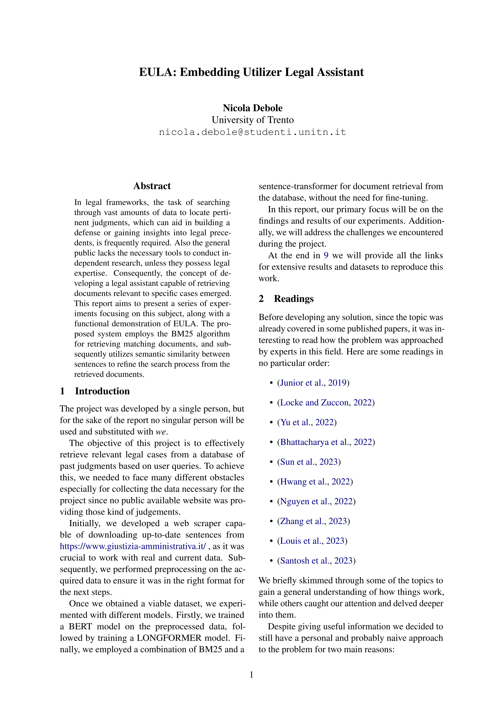
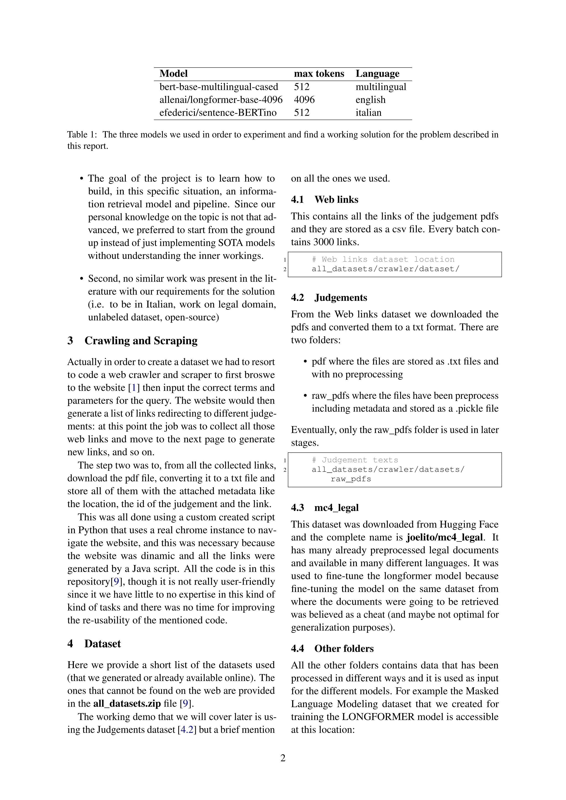
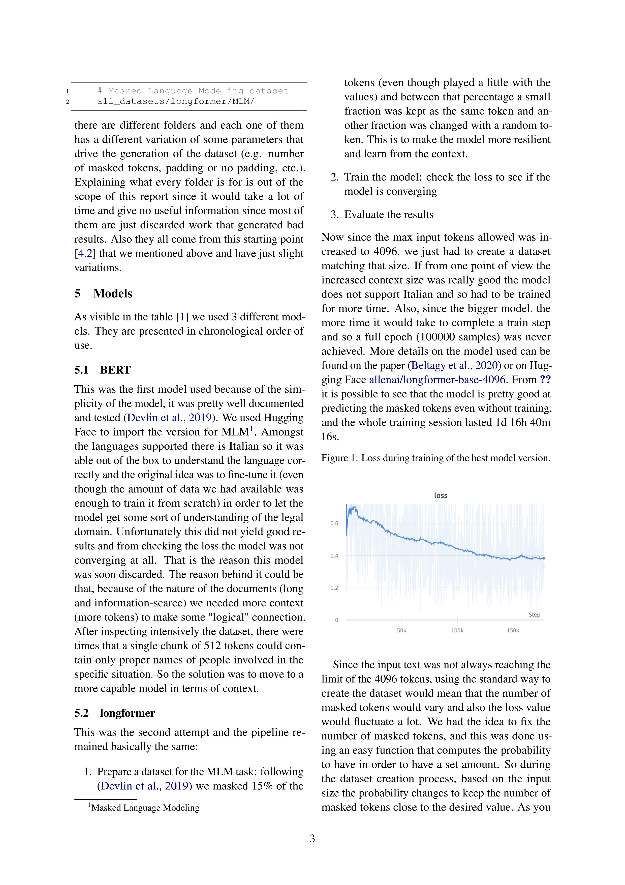
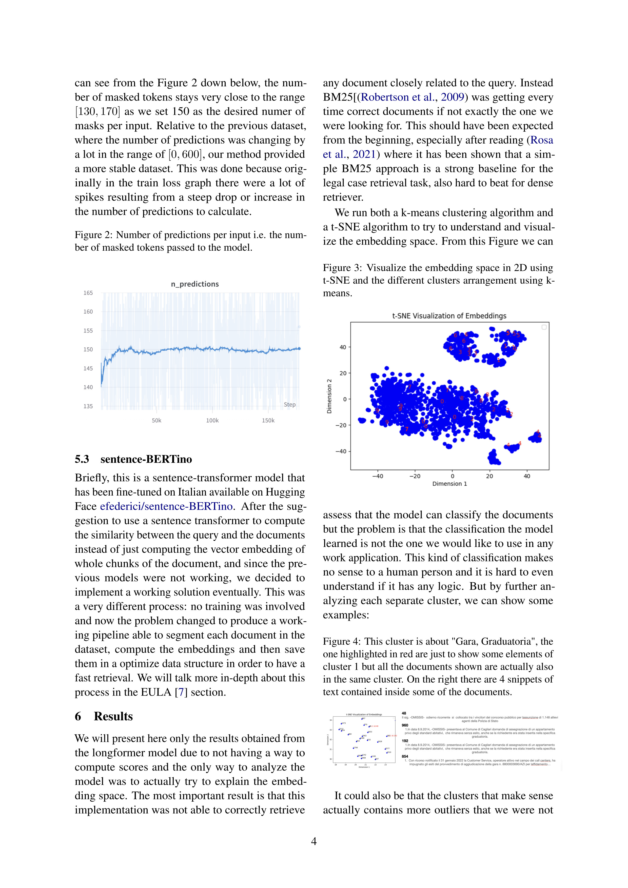
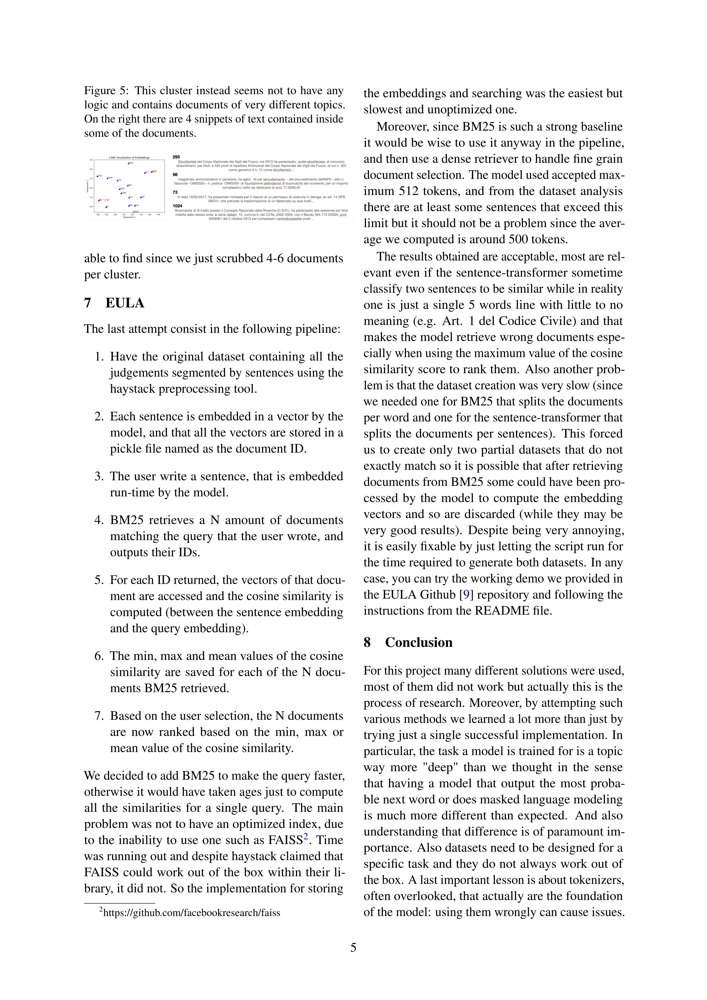
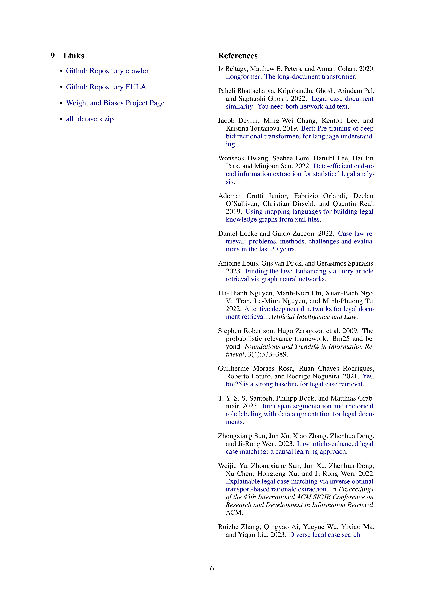

# EULA: Embeddings Utilizer Legal Assistant

# Usage
## Requirements
To create a virtual environment with all the needed requirements to run the demo, I have provided a yaml file to import the environment using Conda. The file is located at: 
```
requirements/anlp.yaml
```

## Clone the repository
```bash
git clone https://github.com/debryu/EULA-Embeddings_Utilizer_Legal_Assistant.git
```
## Dataset
Download  **[all_datasets.zip](https://drive.google.com/file/d/1KNtJkoDFI_hXewhJ0NcM1veDcy6xJGU-/view?usp=sharing)** and extract it. 
## EULA
The demo can be executing by running the python script located at:
```
haystack/5_query.py
```
 ⚠️ Before executing the code, open the file and change the ```all_datasets_folder_path``` variable at line 30 to the path where you extracted the dataset.


After running, it will output the link of the most similar case, the location where it was issued and the position in the ranking. By pressing ENTER it possible to view all the documents that have been retrieved.

# Report





